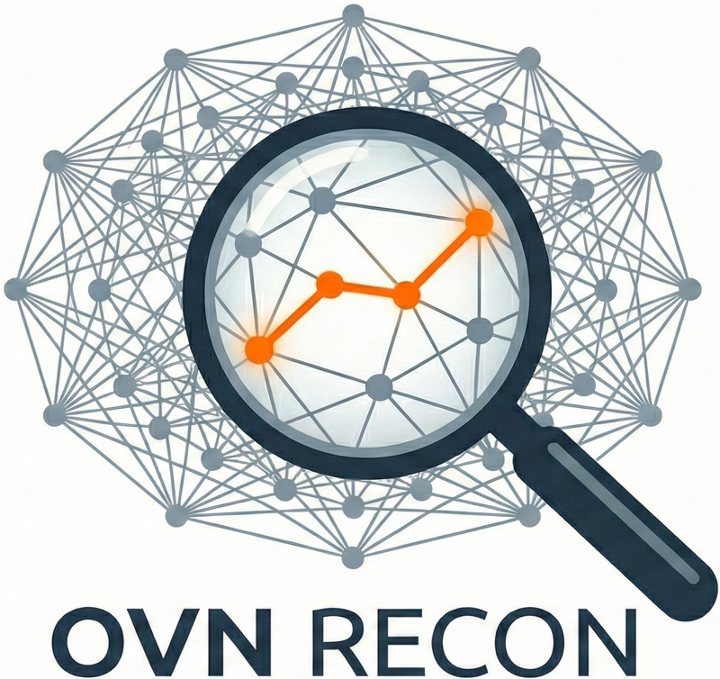
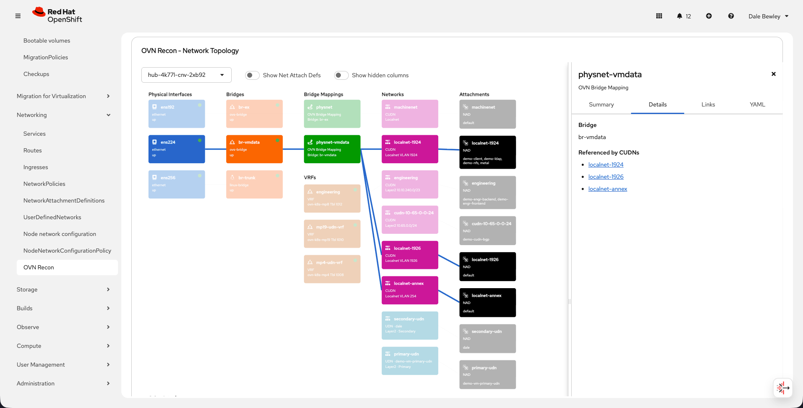
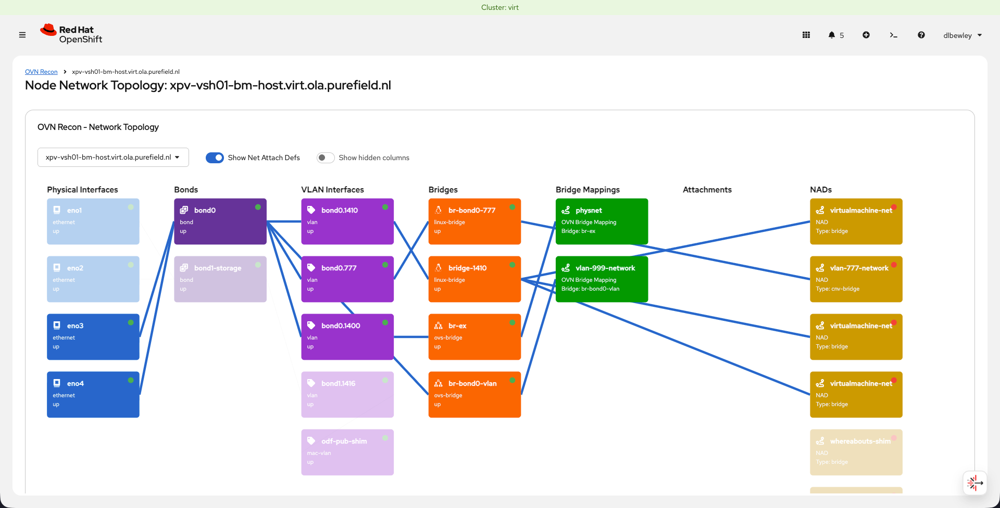

[](https://github.com/dlbewley/ovn-recon/actions/workflows/build-test.yaml)

[](https://quay.io/repository/dbewley/ovn-recon)

# Open Virtual Network Reconnaissance (OVN Recon)

<div align="left">
<a href="img/logo-full.png"></a>
</div>
<div align="right">
<p align="center"><b>Screenshots</b></p>
<a href="img/nns-visualization.png"></a>
<a href="img/nns-visualization-2.png"></a>
<a href="img/nns-visualization-3.png"></a>
</div>

<br clear="all"/>

**Open Virtual Network Reconnaissance (OVN Recon) is an OpenShift Console Plugin that provides a visualization of the Virtual and Node Network State in an OpenShift cluster.**

## Kubernetes Resource Dependencies

OVN Recon visualizes the following Kubernetes Custom Resources:

- **NodeNetworkState (NNS)** - Represents the current network configuration of a node, including interfaces, bridges, and OVN bridge mappings. Provided by the [nmstate operator](https://nmstate.io/).
- **NodeNetworkConfigurationPolicy (NNCP)** - Defines desired network configuration for nodes. Used to configure OVN bridge mappings and physical network interfaces.
- **ClusterUserDefinedNetwork (CUDN)** - Defines overlay networks that can be attached to pods. Part of OpenShift's [OVN-Kubernetes secondary networks](https://docs.openshift.com/container-platform/latest/networking/ovn_kubernetes_network_provider/about-ovn-kubernetes.html).
- **NetworkAttachmentDefinition (NAD)** - Multus CNI resource that references a CUDN and allows pods to attach to secondary networks.

The plugin watches these resources in real-time and renders an interactive topology showing how physical interfaces, bridges, and virtual networks are connected.

## Installation

### Operator Installation (recommended)

Create the Bewley Operators [catalog source](manifests/catalogsource.yaml)

```bash
oc apply -f manifests/catalogsource.yaml
```

Create the [operator subscription](manifests/operator/base).

```bash
oc apply -k manifests/operator/base
```

Create the `ovnrecon` [resource instance](manifests/instance/base) to enable console plugin and deploy OVN Recon application.

```bash
oc apply -k manifests/instance/base
```

Console plugin will be automatically enabled.

For detailed operator deployment instructions, please see [docs/OLM-BUNDLE-GUIDE.md](docs/OLM-BUNDLE-GUIDE.md).

### Manual Installation

Create the namespace, consoleplugin, service, and deployment from [manifests/manual/base](manifests/manual/base) without an operator.

```bash
oc apply -k manifests/manual/base
```

#### Enable the Console Plugin

> [!NOTE]
> When installing via the Operator, this step is not necessary.

Patch the Console Operator config to enable the plugin. Use a JSON patch to append to the list of plugins instead of replacing it:

```bash
oc patch console.operator.openshift.io cluster --type=json \
    --patch '[{"op": "add", "path": "/spec/plugins/-", "value": "ovn-recon"}]'
```

The OpenShift console will reload to apply the changes. You should see a notification that the console has been updated.

## Troubleshooting

For troubleshooting steps, please see [docs/TROUBLESHOOTING.md](docs/TROUBLESHOOTING.md).

## How to Build

For detailed build and developer deployment instructions, please see [docs/BUILDING.md](docs/BUILDING.md).

## References

- [OpenShift Console Dynamic Plugin SDK](https://github.com/openshift/console/tree/master/frontend/packages/console-dynamic-plugin-sdk)
- [Dynamic Plugin SDK README](https://www.npmjs.com/package/@openshift-console/dynamic-plugin-sdk)
- [PatternFly React Documentation](https://www.patternfly.org/v4/components)
- [OpenShift Console GitHub Repository](https://github.com/openshift/console)
- [Example ocp-console-plugin](https://github.com/dlbewley/ocp-console-plugin)
